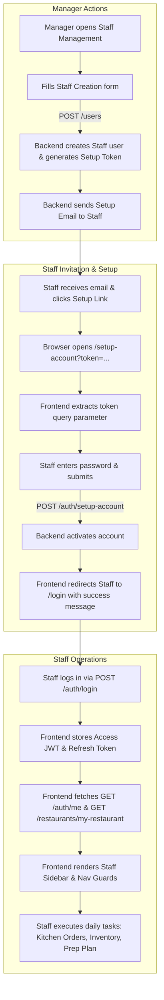

# STAFF FLOW — FRONTEND INTEGRATION GUIDE

This document is the authoritative **Frontend Integration Guide** for implementing the **Staff Flow** and **Staff Role Capabilities** in **BistroMind** (RestoMind).

It provides everything a Frontend developer or AI coding agent needs to build the user interface, handle authentication, manage routing, integrate APIs, and enforce role-based feature visibility without looking at the backend code.

---

## 1. Feature Overview

### What is the Staff Role?
The **Staff** role represents operational restaurant employees (e.g. kitchen prep cooks, line cooks, inventory handlers, cashiers, and floor supervisors).

Staff accounts are strictly tied to a single assigned restaurant (`restaurantId`). Staff members focus on executing day-to-day kitchen and inventory operations without administrative, financial, or management oversight.

### Role Comparison Matrix

| Feature / Responsibility | Staff | Manager | Admin | Customer |
| :--- | :--- | :--- | :--- | :--- |
| **Primary Focus** | Daily kitchen & stock operations | Restaurant management & analytics | System-wide administration | Placing online food orders |
| **Restaurant Scope** | Single assigned restaurant | Single assigned restaurant | All platform restaurants | Public restaurant catalog |
| **Account Creation** | Invited by Manager via Setup link | Approved via Partnership application | Pre-provisioned system user | Self signup (`/auth/signUp`) |
| **User Management** | **None** | Full CRUD over Staff accounts | Full CRUD over all platform users | **None** |
| **Product Catalog** | Read products & toggle item availability | Full CRUD over products & recipes | Full system-wide CRUD | Read active products |
| **Inventory Operations** | Log batches, stock movements & waste | Full operational & inventory access | System-wide access | **None** |
| **Purchase Orders** | View POs & mark shipments received | Create POs & manage suppliers | System-wide access | **None** |
| **Orders Processing** | View kitchen orders & update order status | View orders & update status | View all platform orders | Create & view own orders |
| **Production Planning** | View daily prep plan & log actual output | View daily prep plan & log actuals | System-wide access | **None** |
| **AI, Reports & Analytics** | **Forbidden** (403) | AI predictions, waste & sales reports | Full system-wide access | **None** |

### What Staff Users Do Inside BistroMind
1. **Account Setup & Login**: Complete onboarding via the invitation link sent to their email and log in to the portal.
2. **Product Availability (86ing Items)**: Quickly toggle whether menu items are currently available or sold out.
3. **Inventory Management**: Receive new inventory ingredient batches, log stock additions/deductions, and record waste events (spoilage, spills, expiration).
4. **Kitchen Order Processing**: Monitor incoming orders and update kitchen status (`pending` ➔ `preparing` ➔ `ready` ➔ `completed`).
5. **Purchase Order Receiving**: View incoming supplier orders and mark goods as received when shipments arrive.
6. **Production Plan Execution**: View the daily prep/production plan and record actual quantities produced.

---

## 2. Complete Business Workflow



### Detailed Workflow Step-by-Step

1. **Manager Invites Staff**:
   - The Manager navigates to the Staff Management page and fills in the staff member's basic information (`firstName`, `lastName`, `email`, `phone`, and optional employee details).
   - Frontend calls `POST /users` with `role: "staff"`.

2. **Backend Invitation Dispatch**:
   - Backend creates the user record with `isActive: false` and generates a 72-hour setup token.
   - An email is sent to the staff member with a link formatted as:  
     `${FRONTEND_URL}/setup-account?token=${setupToken}`

3. **Staff Account Setup**:
   - The staff member clicks the link in their email, opening the frontend route `/setup-account?token=...`.
   - The frontend page reads the `token` parameter from the URL.
   - Staff inputs their password and submits the form.
   - Frontend calls `POST /auth/setup-account` with `{ token, password }`.

4. **Account Activation & Login**:
   - Backend activates the account (`isActive = true`, `isEmailVerified = true`).
   - Frontend redirects the user to `/login` with a banner: *"Account setup complete! Please log in."*
   - Staff logs in using their email and password.

5. **Session Initialization & Operational View**:
   - Frontend receives Access Token and Refresh Token, plus the `user` object (`role: "staff"`).
   - Frontend stores tokens securely, fetches current profile (`GET /auth/me`) and restaurant details (`GET /restaurants/my-restaurant`).
   - Navigational controls automatically hide forbidden admin/manager features and show staff operational screens.

---

## 3. Manager Integration

These endpoints are used by the **Manager** to manage staff members within their restaurant.

---

### 3.1 Create Staff
- **HTTP Method**: `POST`
- **URL**: `/users`
- **Authorization**: `Bearer <Manager_Access_Token>`
- **Request Body**:
```json
{
  "firstName": "John",
  "lastName": "Doe",
  "email": "john.staff@restaurant.com",
  "phone": "+12345678901",
  "role": "staff",
  "employeeCode": "EMP-101",
  "department": "Kitchen",
  "hireDate": "2026-08-01T00:00:00.000Z",
  "notes": "Night shift prep cook"
}
```
- **Response** (`201 Created`):
```json
{
  "_id": "66ac4d3e8f123456789abc01",
  "firstName": "John",
  "lastName": "Doe",
  "email": "john.staff@restaurant.com",
  "phone": "+12345678901",
  "role": "staff",
  "restaurantId": "66ac4d3e8f123456789abc00",
  "isActive": false,
  "employmentStatus": "active",
  "employeeCode": "EMP-101",
  "department": "Kitchen",
  "createdAt": "2026-08-02T13:00:00.000Z"
}
```
- **Frontend Notes**:
  - `firstName`, `lastName`, `email`, `phone`, and `role` (`"staff"`) are required.
  - `password` is **NOT** required. The backend auto-generates a temporary random password.
  - `DOB` and `gender` are optional.
  - `restaurantId` is automatically inferred from the Manager's token if omitted.

---

### 3.2 List & Search Staff
- **HTTP Method**: `GET`
- **URL**: `/users`
- **Authorization**: `Bearer <Manager_Access_Token>`
- **Query Parameters**:
  - `search` (string, optional): Search by name, email, or phone.
  - `isActive` (boolean, optional): Filter by active status (`true` / `false`).
  - `employmentStatus` (string, optional): `"active"` | `"inactive"` | `"terminated"`.
  - `page` (number, default: `1`)
  - `limit` (number, default: `10`)
- **Response** (`200 OK`):
```json
{
  "data": [
    {
      "_id": "66ac4d3e8f123456789abc01",
      "firstName": "John",
      "lastName": "Doe",
      "email": "john.staff@restaurant.com",
      "phone": "+12345678901",
      "role": "staff",
      "isActive": true,
      "employmentStatus": "active",
      "department": "Kitchen",
      "employeeCode": "EMP-101"
    }
  ],
  "meta": {
    "total": 1,
    "page": 1,
    "limit": 10,
    "totalPages": 1
  }
}
```
- **Frontend Notes**:
  - When called by a Manager, the backend automatically restricts results to users with `role === "staff"` belonging to the Manager's restaurant.

---

### 3.3 Get Staff Details
- **HTTP Method**: `GET`
- **URL**: `/users/:id`
- **Authorization**: `Bearer <Manager_Access_Token>`
- **Parameters**: `id` (path parameter, string)
- **Response** (`200 OK`): Full Staff User object.
- **Frontend Notes**: Use this to populate a "Staff Member Profile" modal or view.

---

### 3.4 Update Staff Profile
- **HTTP Method**: `PATCH`
- **URL**: `/users/:id`
- **Authorization**: `Bearer <Manager_Access_Token>`
- **Parameters**: `id` (path parameter, string)
- **Request Body**:
```json
{
  "firstName": "John",
  "lastName": "Smith",
  "phone": "+12345678999",
  "employeeCode": "EMP-101-B",
  "department": "Inventory Prep",
  "notes": "Promoted to prep lead"
}
```
- **Response** (`200 OK`): Updated User object.
- **Frontend Notes**: Partial updates are supported. Only send fields that have changed.

---

### 3.5 Activate / Deactivate Staff
- **HTTP Method**: `PATCH`
- **URL**: `/users/:id/status`
- **Authorization**: `Bearer <Manager_Access_Token>`
- **Parameters**: `id` (path parameter, string)
- **Request Body**:
```json
{
  "isActive": false
}
```
- **Response** (`200 OK`):
```json
{
  "_id": "66ac4d3e8f123456789abc01",
  "isActive": false,
  "employmentStatus": "inactive",
  "message": "User status updated successfully"
}
```
- **Frontend Notes**: Use a toggle switch in the UI. Deactivating immediately blocks the staff member from logging in or making API calls.

---

### 3.6 Resend Setup Email
- **HTTP Method**: `POST`
- **URL**: `/users/:id/resend-setup-email`
- **Authorization**: `Bearer <Manager_Access_Token>`
- **Parameters**: `id` (path parameter, string)
- **Response** (`200 OK`):
```json
{
  "message": "Setup email resent successfully."
}
```
- **Frontend Notes**: Provide a "Resend Setup Link" button for staff members whose status is `isActive === false` or `isEmailVerified === false`.

---

### 3.7 Reset Staff Password
- **HTTP Method**: `POST`
- **URL**: `/users/:id/reset-password`
- **Authorization**: `Bearer <Manager_Access_Token>`
- **Parameters**: `id` (path parameter, string)
- **Response** (`200 OK`):
```json
{
  "message": "Password reset link sent to staff email successfully."
}
```
- **Frontend Notes**: Triggers an automated password reset email with a setup token link to the staff member's registered email address.

---

### 3.8 Delete Staff (Soft Delete)
- **HTTP Method**: `DELETE`
- **URL**: `/users/:id`
- **Authorization**: `Bearer <Manager_Access_Token>`
- **Parameters**: `id` (path parameter, string)
- **Response** (`200 OK`):
```json
{
  "message": "User deleted successfully"
}
```
- **Frontend Notes**: Show a confirmation modal before calling delete. This soft-deletes the user (`isDeleted: true`, `isActive: false`, `employmentStatus: "terminated"`).

---

## 4. Staff Onboarding Flow

### Frontend Onboarding Requirements

The Frontend must implement a dedicated route: `/setup-account`.

#### Page Behaviour & Logic
1. **URL Structure**: `/setup-account?token=<JWT_SETUP_TOKEN>`
2. **Token Extraction**: On component mount, extract `token` from URL query string.
   - If `token` is missing: Show error UI: *"Invalid setup link. Please check your invitation email."*
3. **Form Fields**:
   - New Password (min 6 characters)
   - Confirm Password
4. **Form Submission**:
   - Call `POST /auth/setup-account` with `{ token, password }`.

```json
POST /auth/setup-account
Content-Type: application/json

{
  "token": "eyJhbGciOiJIUzI1NiIsInR5cCI6IkpXVCJ9...",
  "password": "StaffPassword123!"
}
```

5. **Response Handling**:
   - **`200 OK`**: Show toast/alert: *"Password set successfully! Redirecting to login..."*, then redirect to `/login`.
   - **`401 Unauthorized`**: Token has expired (72h limit) or is invalid. Display error message with button: *"Token expired. Please contact your restaurant manager to request a new setup email."*

---

## 5. Staff APIs

This section lists **ONLY** the endpoints that users with `role === "staff"` are authorized to call.

---

### 5.1 Auth & Profile

#### GET `/auth/me`
- **Method**: `GET`
- **Authorization**: `Bearer <Staff_Access_Token>`
- **Purpose**: Fetch profile of the logged-in staff member.
- **Request**: Headers: `Authorization: Bearer <accessToken>`
- **Response** (`200 OK`):
```json
{
  "_id": "66ac4d3e8f123456789abc01",
  "firstName": "John",
  "lastName": "Doe",
  "email": "john.staff@restaurant.com",
  "role": "staff",
  "restaurantId": "66ac4d3e8f123456789abc00",
  "department": "Kitchen",
  "isActive": true
}
```
- **Frontend Notes**: Call on application startup/reload to populate user context.

#### POST `/auth/logout`
- **Method**: `POST`
- **Authorization**: `Bearer <Staff_Access_Token>`
- **Purpose**: Invalidate active session.
- **Request**: Header: `Authorization: Bearer <accessToken>`
- **Response** (`200 OK`): `{ "message": "Logout successfully" }`
- **Frontend Notes**: Clear local/session storage tokens and redirect to `/login`.

#### POST `/auth/generate-access-token`
- **Method**: `POST`
- **Authorization**: `Bearer <Staff_Refresh_Token>`
- **Purpose**: Obtain a fresh access token using the refresh token.
- **Request**: Header: `Authorization: Bearer <refreshToken>`
- **Response** (`200 OK`):
```json
{
  "accessToken": "eyJhbGciOiJIUzI1...",
  "refreshToken": "eyJhbGciOiJIUzI1..."
}
```
- **Frontend Notes**: Call automatically via Axios/Fetch interceptor when an API call returns `401 Unauthorized`.

#### PATCH `/auth/update-me`
- **Method**: `PATCH`
- **Authorization**: `Bearer <Staff_Access_Token>`
- **Purpose**: Update own profile details or profile image.
- **Request Body**: `multipart/form-data` or `json`: `{ "firstName": "John", "lastName": "Doe", "phone": "+1234567890" }`
- **Response** (`200 OK`): Updated profile object.

---

### 5.2 Restaurant Information

#### GET `/restaurants/my-restaurant`
- **Method**: `GET`
- **Authorization**: `Bearer <Staff_Access_Token>`
- **Purpose**: Fetch details of the staff member's assigned restaurant.
- **Response** (`200 OK`):
```json
{
  "_id": "66ac4d3e8f123456789abc00",
  "name": "BistroMind Downtown",
  "address": "123 Main St",
  "phone": "+15550001111",
  "currency": "USD"
}
```
- **Frontend Notes**: Use to display the restaurant name and branding in the app header/sidebar.

---

### 5.3 Products & Menu Items

#### GET `/products`
- **Method**: `GET`
- **Authorization**: `Bearer <Staff_Access_Token>`
- **Query Parameters**: `search`, `categoryId`, `isAvailable`, `page`, `limit`
- **Response** (`200 OK`):
```json
{
  "data": [
    {
      "_id": "66ac4d3e8f123456789prod1",
      "name": "Truffle Burger",
      "price": 18.99,
      "isAvailable": true,
      "categoryId": "66ac4d3e8f123456789cat1"
    }
  ],
  "meta": { "total": 1, "page": 1, "limit": 10 }
}
```
- **Frontend Notes**: Use for the Menu / Products list view.

#### GET `/products/:id`
- **Method**: `GET`
- **Authorization**: `Bearer <Staff_Access_Token>`
- **Purpose**: Fetch product details.
- **Response** (`200 OK`): Product details object.

#### PATCH `/products/:id/availability`
- **Method**: `PATCH`
- **Authorization**: `Bearer <Staff_Access_Token>`
- **Purpose**: Toggle item availability (e.g. 86ing an item when ingredients run out).
- **Request Body**:
```json
{
  "isAvailable": false
}
```
- **Response** (`200 OK`):
```json
{
  "_id": "66ac4d3e8f123456789prod1",
  "name": "Truffle Burger",
  "isAvailable": false
}
```
- **Frontend Notes**: Render an instant toggle switch on each product card for quick kitchen availability management.

#### GET `/products/:productId/recipe`
- **Method**: `GET`
- **Authorization**: `Bearer <Staff_Access_Token>`
- **Purpose**: View ingredient breakdown and recipe prep instructions for a menu item.
- **Response** (`200 OK`): Recipe object with list of required ingredients and quantities.
- **Frontend Notes**: Great for kitchen display / prep instructions modal.

---

### 5.4 Inventory Management

#### POST `/inventory/batches`
- **Method**: `POST`
- **Authorization**: `Bearer <Staff_Access_Token>`
- **Purpose**: Log new ingredient batch arrival.
- **Request Body**:
```json
{
  "ingredientId": "66ac4d3e8f123456789ing01",
  "batchNumber": "BATCH-2026-0802",
  "quantityRemaining": 50,
  "unitCost": 3.75,
  "expiryDate": "2026-08-30T00:00:00.000Z",
  "receivedDate": "2026-08-02T00:00:00.000Z"
}
```
- **Response** (`201 Created`): Created batch object.
- **Frontend Notes**: Accepts single batch object or bulk array/batches format.

#### GET `/inventory/batches`
- **Method**: `GET`
- **Authorization**: `Bearer <Staff_Access_Token>`
- **Query Parameters**: `ingredientId`, `isExpired`, `page`, `limit`
- **Response** (`200 OK`): List of active inventory batches with expiration dates.

#### POST `/inventory/transactions`
- **Method**: `POST`
- **Authorization**: `Bearer <Staff_Access_Token>`
- **Purpose**: Log manual stock movement (`in`, `out`, `waste`, `adjustment`).
- **Request Body**:
```json
{
  "ingredientId": "66ac4d3e8f123456789ing01",
  "type": "out",
  "quantity": 10,
  "reason": "Kitchen daily prep",
  "batchId": "66ac4d3e8f123456789batch1"
}
```
- **Response** (`201 Created`): Created stock transaction object.

#### GET `/inventory/transactions`
- **Method**: `GET`
- **Authorization**: `Bearer <Staff_Access_Token>`
- **Query Parameters**: `ingredientId`, `type`, `startDate`, `endDate`, `page`, `limit`
- **Response** (`200 OK`): List of stock transaction logs.

#### POST `/inventory/waste-events`
- **Method**: `POST`
- **Authorization**: `Bearer <Staff_Access_Token>`
- **Purpose**: Log wasted ingredients (spoilage, spills, damage, expiration).
- **Request Body**:
```json
{
  "ingredientId": "66ac4d3e8f123456789ing01",
  "quantity": 3,
  "reason": "spoilage",
  "notes": "Expired in cooler",
  "batchId": "66ac4d3e8f123456789batch1"
}
```
- **Response** (`201 Created`): Waste event object.
- **Frontend Notes**: Allowed reasons: `"spoilage"`, `"expiration"`, `"spill"`, `"damage"`, `"other"`.

#### GET `/inventory/waste-events`
- **Method**: `GET`
- **Authorization**: `Bearer <Staff_Access_Token>`
- **Query Parameters**: `ingredientId`, `reason`, `startDate`, `endDate`, `page`, `limit`
- **Response** (`200 OK`): List of logged waste events.

---

### 5.5 Ingredients

#### GET `/ingredients`
- **Method**: `GET`
- **Authorization**: `Bearer <Staff_Access_Token>`
- **Query Parameters**: `search`, `page`, `limit`
- **Response** (`200 OK`): List of ingredient definitions with current stock balances.

#### GET `/ingredients/:id`
- **Method**: `GET`
- **Authorization**: `Bearer <Staff_Access_Token>`
- **Purpose**: Get specific ingredient details.
- **Response** (`200 OK`): Ingredient object.

---

### 5.6 Purchase Orders

#### GET `/purchase-orders`
- **Method**: `GET`
- **Authorization**: `Bearer <Staff_Access_Token>`
- **Query Parameters**: `status`, `supplierId`, `page`, `limit`
- **Response** (`200 OK`): List of purchase orders.

#### PATCH `/purchase-orders/:id/receive`
- **Method**: `PATCH`
- **Authorization**: `Bearer <Staff_Access_Token>`
- **Purpose**: Mark a purchase order shipment as received upon delivery.
- **Response** (`200 OK`): Updated purchase order with status `"received"`.
- **Frontend Notes**: Staff can view purchase orders and mark incoming shipments as received, but **cannot** create or modify PO pricing.

---

### 5.7 Suppliers

#### GET `/suppliers`
- **Method**: `GET`
- **Authorization**: `Bearer <Staff_Access_Token>`
- **Query Parameters**: `search`, `page`, `limit`
- **Response** (`200 OK`): Directory of suppliers and contact numbers.

---

### 5.8 Orders (Kitchen Processing)

#### GET `/orders`
- **Method**: `GET`
- **Authorization**: `Bearer <Staff_Access_Token>`
- **Query Parameters**: `status`, `page`, `limit`
- **Response** (`200 OK`): List of active customer orders for the restaurant.

#### GET `/orders/:id`
- **Method**: `GET`
- **Authorization**: `Bearer <Staff_Access_Token>`
- **Purpose**: View order items and prep tickets.
- **Response** (`200 OK`): Order details object.

#### PATCH `/orders/:id/status`
- **Method**: `PATCH`
- **Authorization**: `Bearer <Staff_Access_Token>`
- **Purpose**: Advance kitchen order status.
- **Request Body**:
```json
{
  "status": "preparing"
}
```
- **Allowed Status Values**: `"pending"`, `"preparing"`, `"ready"`, `"completed"`, `"cancelled"`.
- **Response** (`200 OK`): Updated order status.
- **Frontend Notes**: Perfect for a Kanban Kitchen Display System (KDS) with columns: Pending ➔ Preparing ➔ Ready ➔ Completed.

---

### 5.9 Offers

#### GET `/offers`
- **Method**: `GET`
- **Authorization**: `Bearer <Staff_Access_Token>`
- **Query Parameters**: `status`, `page`, `limit`
- **Response** (`200 OK`): List of active restaurant promotions.

#### GET `/offers/:id`
- **Method**: `GET`
- **Authorization**: `Bearer <Staff_Access_Token>`
- **Purpose**: View promotional offer details.
- **Response** (`200 OK`): Offer details.

---

### 5.10 Production Planning

#### GET `/predictions/production-plan`
- **Method**: `GET`
- **Authorization**: `Bearer <Staff_Access_Token>`
- **Query Parameters**: `date` (YYYY-MM-DD string)
- **Response** (`200 OK`):
```json
{
  "date": "2026-08-02",
  "items": [
    {
      "productId": "66ac4d3e8f123456789prod1",
      "productName": "Truffle Burger Prep",
      "plannedQuantity": 50,
      "actualQuantity": 0
    }
  ]
}
```
- **Frontend Notes**: Kitchen staff use this view to see required daily prep quantities.

#### POST `/predictions/production-plan/actuals`
- **Method**: `POST`
- **Authorization**: `Bearer <Staff_Access_Token>`
- **Purpose**: Log actual prep output completed by kitchen staff.
- **Request Body**:
```json
{
  "date": "2026-08-02",
  "items": [
    {
      "productId": "66ac4d3e8f123456789prod1",
      "actualQuantity": 48
    }
  ]
}
```
- **Response** (`200 OK`): Updated production plan record.

---

## 6. Features Unavailable for Staff

The Frontend MUST hide all UI links, navigation items, buttons, and pages for the following modules when logged in as a Staff user (`user.role === "staff"`). Calling these endpoints will result in an HTTP `403 Forbidden` error.

```
┌────────────────────────────────────────────────────────────────────────┐
│                      FORBIDDEN FOR STAFF USERS                         │
├────────────────────────────────────────────────────────────────────────┤
│ ❌ AI Predictions & Weekly Forecasting (/predictions/*)                │
│ ❌ Waste Reports & Historical Analytics (/waste-reports/*)             │
│ ❌ Sales Reports & Revenue Analytics (/sales/*)                        │
│ ❌ AI Recommendations (/recommendations/*)                             │
│ ❌ Manager Dashboard (/dashboard/manager)                              │
│ ❌ Admin Dashboard (/dashboard/admin)                                  │
│ ❌ User & Staff Management (/users/*)                                  │
│ ❌ Restaurant Settings & Creation (/restaurants/*)                     │
│ ❌ Bulk Data CSV/Excel Imports (/imports/*)                            │
│ ❌ Partnership Application Administration (/partnership-applications)│
│ ❌ Creating / Deleting Products (`POST /products`, `DELETE /products`) │
│ ❌ Creating / Editing Recipes (`PUT /products/:id/recipe`)             │
│ ❌ Creating / Deleting Ingredients (`POST /ingredients`)               │
│ ❌ Creating / Managing Suppliers (`POST /suppliers`)                   │
│ ❌ Creating / Cancelling Purchase Orders (`POST /purchase-orders`)     │
│ ❌ Creating / Editing Offers (`POST /offers`, `PATCH /offers/:id`)     │
│ ❌ Category Management (`POST /categories`, `DELETE /categories`)      │
└────────────────────────────────────────────────────────────────────────┘
```

---

## 7. Authentication Flow

```
                     ┌───────────────────────────┐
                     │ Staff Invitation Link     │
                     │ /setup-account?token=...  │
                     └─────────────┬─────────────┘
                                   │
                                   ▼
                     ┌───────────────────────────┐
                     │ POST /auth/setup-account  │
                     └─────────────┬─────────────┘
                                   │
                                   ▼
                     ┌───────────────────────────┐
                     │ POST /auth/login          │
                     └─────────────┬─────────────┘
                                   │
                     ┌─────────────┴─────────────┐
                     ▼                           ▼
          ┌─────────────────────┐     ┌─────────────────────┐
          │ Access Token (JWT)  │     │ Refresh Token (JWT) │
          │ (Expires short-term)│     │ (Stored securely)   │
          └──────────┬──────────┘     └──────────┬──────────┘
                     │                           │
                     ▼                           ▼
          ┌─────────────────────┐     ┌─────────────────────┐
          │ Attached to Headers │     │ Used via POST       │
          │ Authorization:      │     │ /auth/generate-     │
          │ Bearer <token>      │     │ access-token on 401 │
          └─────────────────────┘     └─────────────────────┘
```

### Key Frontend Authentication Directives

1. **Token Storage**:
   - Access Token: Store in memory / state manager (React Context, Redux, Zustand).
   - Refresh Token: Store in secure storage or HttpOnly cookie.

2. **HTTP Interceptor**:
   - Attach `Authorization: Bearer <accessToken>` to every outgoing HTTP request.
   - Intercept HTTP `401 Unauthorized` responses:
     - Automatically call `POST /auth/generate-access-token` with header `Authorization: Bearer <refreshToken>`.
     - Retry the original request with the new access token.
     - If refresh fails: Clear session and redirect to `/login?session=expired`.

3. **HTTP `403 Forbidden` Handling**:
   - If an API returns `403 Forbidden`, display a global warning toast: *"Access Denied: You do not have permission to perform this action."* Do NOT log the user out on 403.

4. **Logout Flow**:
   - Call `POST /auth/logout`.
   - Clear all local state and tokens.
   - Redirect to `/login`.

---

## 8. Frontend Routing & Page Map

Implement the following pages and route guards for the Staff experience:

### 1. `/setup-account` (Public)
- **Component**: `SetupAccountPage`
- **APIs Consumed**: `POST /auth/setup-account`
- **Description**: Password creation page accessed via email setup link token.

### 2. `/login` (Public)
- **Component**: `LoginPage`
- **APIs Consumed**: `POST /auth/login`
- **Description**: Standard login form for email & password.

### 3. `/staff/orders` (Kitchen Display System / Orders)
- **Component**: `KitchenOrdersPage`
- **APIs Consumed**: `GET /orders`, `GET /orders/:id`, `PATCH /orders/:id/status`
- **Description**: Kanban or table view of incoming customer orders. Allows advancing order status (`pending` ➔ `preparing` ➔ `ready` ➔ `completed`).

### 4. `/staff/products` (Menu & Availability)
- **Component**: `StaffProductsPage`
- **APIs Consumed**: `GET /products`, `PATCH /products/:id/availability`, `GET /products/:id/recipe`
- **Description**: Product catalog view with quick toggle switches to 86/enable items and view recipe prep details.

### 5. `/staff/inventory` (Batches & Stock Management)
- **Component**: `StaffInventoryPage`
- **APIs Consumed**: `GET /inventory/batches`, `POST /inventory/batches`, `POST /inventory/transactions`, `GET /inventory/transactions`, `GET /ingredients`
- **Description**: Tabs for receiving new ingredient batches and logging stock movements.

### 6. `/staff/waste` (Waste Logging)
- **Component**: `StaffWastePage`
- **APIs Consumed**: `POST /inventory/waste-events`, `GET /inventory/waste-events`, `GET /ingredients`
- **Description**: Simple form to log spoiled, damaged, or expired ingredients.

### 7. `/staff/purchase-orders` (PO Receiving)
- **Component**: `StaffPurchaseOrdersPage`
- **APIs Consumed**: `GET /purchase-orders`, `PATCH /purchase-orders/:id/receive`
- **Description**: List incoming supplier purchase orders with a button to mark orders as received when shipments arrive.

### 8. `/staff/production-plan` (Daily Prep Plan)
- **Component**: `StaffProductionPlanPage`
- **APIs Consumed**: `GET /predictions/production-plan`, `POST /predictions/production-plan/actuals`
- **Description**: Daily kitchen prep checklist with input fields to submit actual produced quantities.

### 9. `/staff/profile` (Account Profile)
- **Component**: `StaffProfilePage`
- **APIs Consumed**: `GET /auth/me`, `PATCH /auth/update-me`, `POST /auth/logout`
- **Description**: View user profile details and update personal info.

---

## 9. Recommended API Integration Order

Follow this recommended sequence when implementing the frontend:

```
┌─────────────────────────────────────────────────────────────┐
│ 1. Authentication & Setup                                   │
│    POST /auth/setup-account ➔ POST /auth/login ➔ GET /auth/me│
├─────────────────────────────────────────────────────────────┤
│ 2. Layout & Branding                                        │
│    GET /restaurants/my-restaurant + Nav Guard setup         │
├─────────────────────────────────────────────────────────────┤
│ 3. Products & Availability Toggle                           │
│    GET /products ➔ PATCH /products/:id/availability         │
├─────────────────────────────────────────────────────────────┤
│ 4. Kitchen Orders Processing (KDS)                          │
│    GET /orders ➔ PATCH /orders/:id/status                   │
├─────────────────────────────────────────────────────────────┤
│ 5. Inventory & Stock Management                             │
│    GET /ingredients ➔ GET /inventory/batches ➔ POST batches │
├─────────────────────────────────────────────────────────────┤
│ 6. Waste Event Logging                                      │
│    GET /inventory/waste-events ➔ POST /inventory/waste-events│
├─────────────────────────────────────────────────────────────┤
│ 7. Purchase Order Receiving                                 │
│    GET /purchase-orders ➔ PATCH /purchase-orders/:id/receive│
├─────────────────────────────────────────────────────────────┤
│ 8. Daily Production Plan                                    │
│    GET /predictions/production-plan ➔ POST actuals          │
└─────────────────────────────────────────────────────────────┘
```

---

## 10. Frontend Integration Checklist

Use this checklist to verify the frontend implementation:

### Onboarding & Authentication
- [ ] `/setup-account` page correctly extracts `token` from URL query params.
- [ ] `/setup-account` submits `POST /auth/setup-account` and redirects to `/login` on success.
- [ ] Expired or invalid setup token displays error message directing user to request a new link from Manager.
- [ ] Login via `POST /auth/login` stores Access & Refresh tokens.
- [ ] HTTP interceptor automatically refreshes access tokens via `POST /auth/generate-access-token` on 401.
- [ ] Logout via `POST /auth/logout` clears tokens and redirects to `/login`.

### Manager Staff Management UI
- [ ] Manager can create Staff via `POST /users` (password, DOB, and gender are NOT required).
- [ ] Manager can list and search Staff via `GET /users`.
- [ ] Manager can view Staff details via `GET /users/:id`.
- [ ] Manager can update Staff profile via `PATCH /users/:id`.
- [ ] Manager can toggle Staff active status via `PATCH /users/:id/status`.
- [ ] Manager can resend setup invitation via `POST /users/:id/resend-setup-email`.
- [ ] Manager can trigger staff password reset via `POST /users/:id/reset-password`.
- [ ] Manager can delete Staff via `DELETE /users/:id`.

### Staff UI Features & Operational Pages
- [ ] Header/Sidebar displays current restaurant name from `GET /restaurants/my-restaurant`.
- [ ] Kitchen Orders page lists orders (`GET /orders`) and updates status (`PATCH /orders/:id/status`).
- [ ] Products page lists products (`GET /products`) and toggles availability (`PATCH /products/:id/availability`).
- [ ] Products page displays recipe modal via `GET /products/:productId/recipe`.
- [ ] Inventory page lists batches (`GET /inventory/batches`) and logs new batches (`POST /inventory/batches`).
- [ ] Stock transactions can be logged via `POST /inventory/transactions`.
- [ ] Waste page logs waste events via `POST /inventory/waste-events`.
- [ ] Purchase Orders page lists POs (`GET /purchase-orders`) and allows marking as received (`PATCH /purchase-orders/:id/receive`).
- [ ] Production Plan page displays daily checklist (`GET /predictions/production-plan`) and records actuals (`POST /predictions/production-plan/actuals`).

### Navigation Guards & Role Protection
- [ ] Sidebar hides links for Predictions, Waste Reports, Sales Analytics, Dashboard Analytics, User Management, and Settings when `user.role === "staff"`.
- [ ] Route guards prevent direct URL navigation to forbidden pages for Staff users.
- [ ] API `403 Forbidden` responses trigger user-friendly toast notifications without breaking application state.
